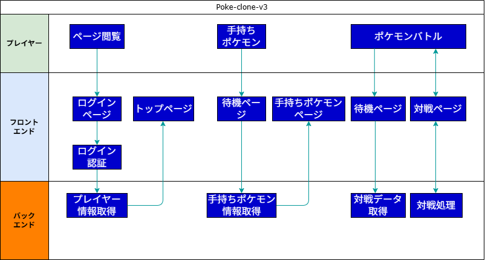

# Poke-clone-v3要件定義

## システム作成の目的

### WebSocketを利用した他ユーザとの対戦機能の実装

poke-clone-v1, v2では、他ユーザとの対戦機能が実装されていなかったため、今回はWebSocketを利用してリアルタイムで他ユーザと対戦できる機能を実装する.

### poke-cloneのシステム構成の見直し

poke-clone-v1, v2では、実際の運用が難しいシステム構成となっていたため、今回はすべてのシステムの構成要素をMicrosoft Azure上で動かすせるように実装を行う.

### システム開発の勉強

poke-clone-v1, v2では、システム設計に関する資料が甘くその場その場での定義が多く、あとから混乱してしまうことがあったため今回は設計 → 実装の流れを徹底したい.Storybook, ESLint, Prettierなどのツールを利用して、保守性の高いコードを書くことを目指す.
またCI/CDの導入も行い、開発工程の一部自動化を実践的に学ぶ.

### テストの実施

poke-clone-v1, v2では、テストをほとんど実施していなかった.
今回はReact Testing Library, Dreddを利用して、ユニットテスト, 結合テストを実施する.

### コーディングエージェントを利用しない実装

poke-clone-v1, v2では、コーディングエージェントを利用して実装を行っていたが、今回は自分の力で実装を行うことで、TypeScriptへの理解を向上させる.
ただし一部の冗長で繰り返しの多い処理はコーディングエージェントを利用し、疑問点や実装の難しい部分に関してはチャット機能によるサポートを受けることがある.

## 機能要件

| 機能名 | 概要 |
|---|---|
| ユーザ認証 | ユーザの新規登録, ログイン |
| ポケモン情報 | ポケモンに関するデータのやり取り |
| 手持ちポケモン情報 | ユーザの手持ちポケモンに関するデータのやり取り |
| ポケモンバトル | 野生・または他ユーザとのポケモンバトル |

## システムのフロー

## 非機能要件

| 項目 | 内容 |
|---|---|
| フロントエンド開発言語 | TypeScript |
| フロントエンドフレームワーク | Next.js v15 |
| スタイルライブラリ | Tailwind CSS |
| バックエンド開発言語 | C# |
| バックエンドフレームワーク | ASP.NET Core 7 |
| データベース | Azure SQL Database |
| ORM | Entity Framework Core |
| ポケモンデータ | PokeAPI |
| API | Azure API Management |
| WebSocket | Azure Web PubSub |
| ホスティング | Vercel |
| CI/CD | GitHub Actions |
| テスト | React Testing Library, Dredd |
| 認証 | Microsoft Entra IDにてGoogleアカウント, Microsoftアカウントでの認証 |
| 認証情報(JWT)の保存 |　HttpOnlyクッキー |
